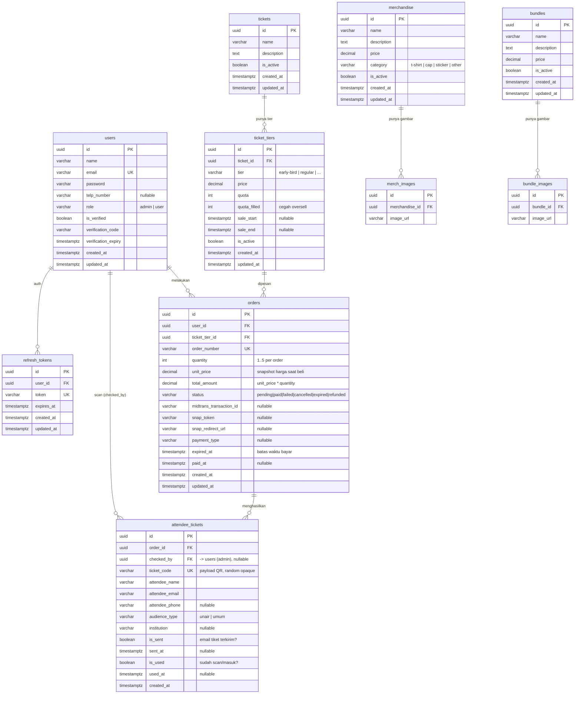
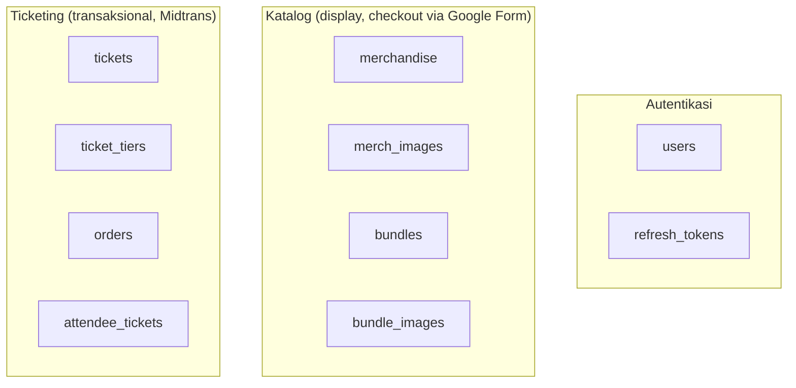
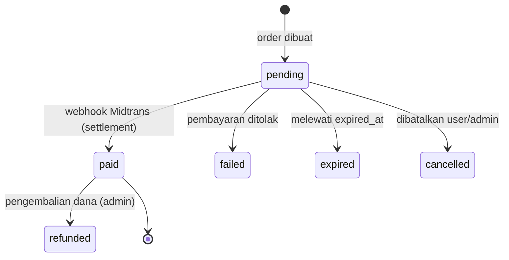
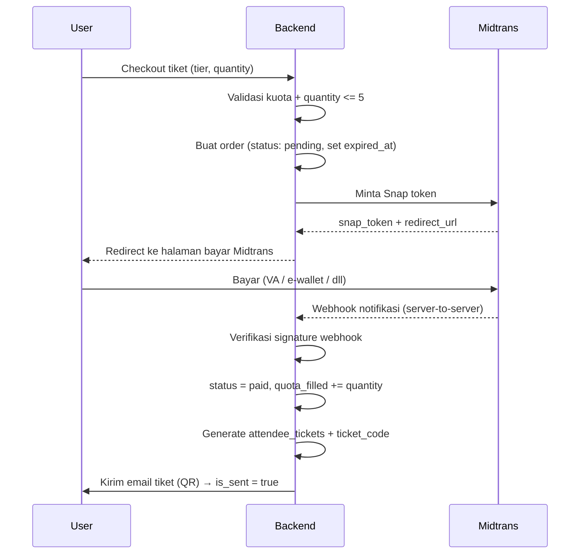

# Skema Database — TEDx UNAIR Backend

Dokumen ini menjelaskan struktur database project: entitas, kolom, relasi antar-tabel,
dan alur bisnis yang mendasarinya. Gunakan sebagai acuan saat membuat entity, repository,
atau menulis query.

> **Ruang lingkup.** Skema saat ini mencakup: autentikasi (users, refresh_tokens),
> katalog **merchandise** & **bundle** (display saja — checkout via Google Form),
> serta alur **tiket** lengkap (tiket → tier → order → tiket hadirin) dengan pembayaran
> Midtrans dan check-in berbasis kode/QR.

---

## 1. Ringkasan & Keputusan Desain

Beberapa keputusan penting yang menjelaskan **kenapa** skema ini berbentuk demikian:

| Keputusan | Penjelasan |
|-----------|------------|
| **Merch & Bundle hanya katalog** | Pembelian merch/bundle diarahkan ke **satu Google Form global**. Backend hanya menyimpan data display (nama, deskripsi, harga, gambar). Tidak ada tabel transaksi untuk merch/bundle. |
| **Tiket transaksional penuh** | Pembelian tiket diproses lewat **Midtrans**. Menghasilkan `order` dan `attendee_tickets` (tiket QR per hadirin). |
| **Ticket punya banyak Tier** | `tickets` = acara/produk. `ticket_tiers` = varian harga (early-bird, regular, dst). Harga, kuota, dan window penjualan menempel di **tier**, bukan di ticket. |
| **Order menunjuk ke tier** | `orders.ticket_tier_id` menunjuk ke tier karena tier yang menentukan harga. |
| **Snapshot harga di order** | `orders.unit_price` menyimpan harga saat pembelian, sehingga perubahan harga tier di kemudian hari tidak mengubah riwayat order lama. |
| **Kuota anti-oversell** | `ticket_tiers.quota_filled` melacak jumlah terjual. Wajib di-update dalam transaksi DB + row lock (lihat [§6](#6-catatan-implementasi)). |
| **Limit 5 per order** | `orders.quantity` dibatasi 1–5 per order per jenis tiket. Divalidasi di lapisan service. |
| **Role admin untuk scan** | Panitia check-in memakai role `admin`. `attendee_tickets.checked_by` mencatat admin yang melakukan scan. |
| **Check-in atomik** | Status `is_used` diubah lewat satu query atomik untuk mencegah satu tiket dipakai dua kali. |

---

## 2. Diagram Relasi (ERD)



---

## 3. Kelompok Entitas

Skema terbagi menjadi tiga domain:



---

## 4. Detail Entitas

### 4.1 `users`
Menyimpan akun pengguna (pembeli maupun admin/panitia).

| Kolom | Tipe | Keterangan |
|-------|------|------------|
| `id` | uuid, PK | Identitas unik pengguna. |
| `name` | varchar | Nama lengkap. |
| `email` | varchar, **unique** | Dipakai untuk login & pengiriman tiket. |
| `password` | varchar | Hash password (jangan simpan plaintext). |
| `telp_number` | varchar, nullable | Nomor telepon opsional. |
| `role` | varchar | `admin` atau `user`. Menentukan hak akses. |
| `is_active` | boolean | Admin dapat menonaktifkan akun tanpa menghapus data. |
| `is_verified` | boolean | Status verifikasi email. |
| `verification_code` | varchar | Kode OTP verifikasi email. |
| `verification_expiry` | timestamptz | Kedaluwarsa kode verifikasi. |
| `created_at`, `updated_at` | timestamptz | Audit waktu. |

**Peran:** `user` membeli tiket; `admin` mengelola data, memproses order, dan melakukan check-in (scan). Tidak ada role panitia terpisah — panitia memakai `admin`.

---

### 4.2 `refresh_tokens`
Menyimpan refresh token opaque untuk memperpanjang sesi login (JWT access token berumur pendek, refresh token berumur panjang).

| Kolom | Tipe | Keterangan |
|-------|------|------------|
| `id` | uuid, PK | — |
| `user_id` | uuid, FK → `users.id` | Pemilik token. |
| `token` | varchar, **unique** | Nilai refresh token. |
| `expires_at` | timestamptz | Kedaluwarsa token. |
| `created_at`, `updated_at` | timestamptz | Audit waktu. |

---

### 4.3 `merchandise`
Katalog produk merchandise. **Display saja** — tidak ada transaksi di backend.

| Kolom | Tipe | Keterangan |
|-------|------|------------|
| `id` | uuid, PK | — |
| `name` | varchar | Nama produk. |
| `description` | text | Deskripsi panjang. |
| `price` | decimal | Harga tampilan. |
| `category` | varchar | `t-shirt`, `cap`, `sticker`, `other`. |
| `is_active` | boolean | Sembunyikan dari katalog bila `false`. |
| `created_at`, `updated_at` | timestamptz | Audit waktu. |

**Alur beli:** user melihat katalog & detail → menambah ke cart (di frontend) → diarahkan ke **Google Form global** untuk menyelesaikan pemesanan. Backend tidak menyimpan pesanan merch.

---

### 4.4 `merch_images`
Galeri gambar untuk tiap merchandise (satu merch bisa banyak gambar).

| Kolom | Tipe | Keterangan |
|-------|------|------------|
| `id` | uuid, PK | — |
| `merchandise_id` | uuid, FK → `merchandise.id` | Merch pemilik gambar. |
| `image_url` | varchar | URL gambar. |

---

### 4.5 `bundles`
Katalog paket (bundle). Sama seperti merch: **display saja**, checkout via Google Form.

| Kolom | Tipe | Keterangan |
|-------|------|------------|
| `id` | uuid, PK | — |
| `name` | varchar | Nama bundle. |
| `description` | text | Deskripsi. |
| `price` | decimal | Harga tampilan. |
| `is_active` | boolean | Sembunyikan bila `false`. |
| `created_at`, `updated_at` | timestamptz | Audit waktu. |

---

### 4.6 `bundle_images`
Galeri gambar untuk tiap bundle (satu bundle bisa banyak gambar).

| Kolom | Tipe | Keterangan |
|-------|------|------------|
| `id` | uuid, PK | — |
| `bundle_id` | uuid, FK → `bundles.id` | Bundle pemilik gambar. |
| `image_url` | varchar | URL gambar. |

---

### 4.7 `tickets`
Mewakili **acara/produk tiket** (mis. "TEDxUnair Main Event"). Tidak memuat harga — harga ada di tier.

| Kolom | Tipe | Keterangan |
|-------|------|------------|
| `id` | uuid, PK | — |
| `name` | varchar | Nama acara/tiket. |
| `description` | text | Deskripsi acara. |
| `is_active` | boolean | Sembunyikan bila `false`. |
| `created_at`, `updated_at` | timestamptz | Audit waktu. |

---

### 4.8 `ticket_tiers`
**Varian harga** dari sebuah tiket (early-bird, regular, dst). Di sinilah harga, kuota, dan jadwal penjualan berada.

| Kolom | Tipe | Keterangan |
|-------|------|------------|
| `id` | uuid, PK | — |
| `ticket_id` | uuid, FK → `tickets.id` | Tiket induk. |
| `tier` | varchar | Nama tier: `early-bird`, `regular`, dst. |
| `price` | decimal | Harga tier ini. |
| `quota` | int | Total kuota tier. |
| `quota_filled` | int | Jumlah terjual (naik saat order dibayar). Cegah oversell. |
| `sale_start` | timestamptz, nullable | Mulai penjualan tier. |
| `sale_end` | timestamptz, nullable | Akhir penjualan tier. |
| `is_active` | boolean | Nonaktifkan tier bila `false`. |
| `created_at`, `updated_at` | timestamptz | Audit waktu. |

**Kuota tersisa** = `quota - quota_filled`. Tier dianggap habis bila `quota_filled >= quota`.

---

### 4.9 `orders`
Transaksi pembelian tiket lewat Midtrans. Satu order = pembelian satu tier dengan jumlah tertentu.

| Kolom | Tipe | Keterangan |
|-------|------|------------|
| `id` | uuid, PK | — |
| `user_id` | uuid, FK → `users.id` | Pembeli. |
| `ticket_tier_id` | uuid, FK → `ticket_tiers.id` | Tier yang dibeli (penentu harga). |
| `order_number` | varchar, **unique** | Nomor order, referensi ke Midtrans. |
| `quantity` | int | Jumlah tiket, **1–5 per order**. |
| `unit_price` | decimal | **Snapshot** harga tier saat beli. |
| `total_amount` | decimal | `unit_price × quantity`. |
| `status` | varchar | `pending`, `paid`, `failed`, `cancelled`, `expired`, `refunded`. |
| `midtrans_transaction_id` | varchar, nullable | ID transaksi dari Midtrans. |
| `snap_token` | varchar, nullable | Token Snap Midtrans. |
| `snap_redirect_url` | varchar, nullable | URL halaman bayar Midtrans. |
| `payment_type` | varchar, nullable | Metode bayar (VA, e-wallet, dll). |
| `expired_at` | timestamptz | Batas waktu bayar (auto-cancel bila lewat). |
| `paid_at` | timestamptz, nullable | Waktu pembayaran berhasil. |
| `created_at`, `updated_at` | timestamptz | Audit waktu. |

**Status order (state machine):**



---

### 4.10 `attendee_tickets`
Tiket per **hadirin** yang dihasilkan dari order yang sudah dibayar. Satu order `quantity = 3` menghasilkan 3 baris di sini. Inilah objek yang membawa **QR code** dan di-scan saat masuk acara.

| Kolom | Tipe | Keterangan |
|-------|------|------------|
| `id` | uuid, PK | — |
| `order_id` | uuid, FK → `orders.id` | Order asal. |
| `checked_by` | uuid, FK → `users.id`, nullable | Admin yang melakukan check-in. |
| `ticket_code` | varchar, **unique** | Payload QR — **string acak opaque**, bukan sekuensial. |
| `attendee_name` | varchar | Nama hadirin. |
| `attendee_email` | varchar | Email tujuan pengiriman tiket. |
| `attendee_phone` | varchar, nullable | Telepon hadirin. |
| `audience_type` | varchar | `unair` atau `umum`. |
| `institution` | varchar, nullable | Nama institusi (bila `umum`). |
| `is_sent` | boolean | Apakah email tiket sudah terkirim. |
| `sent_at` | timestamptz, nullable | Waktu email terkirim. |
| `is_used` | boolean | Apakah tiket sudah dipakai (check-in). |
| `used_at` | timestamptz, nullable | Waktu check-in. |
| `created_at` | timestamptz | Waktu dibuat. |

> Catatan: tabel ini hanya punya `created_at` (tanpa `updated_at`), karena statusnya
> dilacak lewat kolom eksplisit (`is_sent`/`sent_at`, `is_used`/`used_at`).

---

## 5. Relasi Antar-Tabel

| Relasi | Kardinalitas | Arti |
|--------|--------------|------|
| `users` → `refresh_tokens` | 1 : banyak | Satu user punya banyak refresh token. |
| `users` → `orders` | 1 : banyak | Satu user melakukan banyak order. |
| `users` → `attendee_tickets` (`checked_by`) | 1 : banyak | Satu admin men-scan banyak tiket. |
| `tickets` → `ticket_tiers` | 1 : banyak | Satu tiket punya banyak tier harga. |
| `ticket_tiers` → `orders` | 1 : banyak | Satu tier dipesan di banyak order. |
| `orders` → `attendee_tickets` | 1 : banyak | Satu order menghasilkan banyak tiket hadirin. |
| `merchandise` → `merch_images` | 1 : banyak | Satu merch punya banyak gambar. |
| `bundles` → `bundle_images` | 1 : banyak | Satu bundle punya banyak gambar. |

**Aturan integritas yang disarankan:**
- Gambar (`merch_images`, `bundle_images`) sebaiknya `ON DELETE CASCADE` terhadap induknya — hapus merch/bundle, gambar ikut terhapus.
- `orders` dan `attendee_tickets` **jangan** cascade-delete dari user/tier — data transaksi harus dipertahankan untuk audit. Gunakan `is_active`/soft-delete di induk.

---

## 6. Catatan Implementasi

Beberapa hal yang **bukan** soal skema, tapi wajib diperhatikan saat implementasi:

### Uang (`decimal`)
Semua kolom harga (`price`, `unit_price`, `total_amount`) memakai `decimal` agar akurat.
**Jangan gunakan `float`/`double`** untuk uang (rawan galat pembulatan). Di Go, GORM
memetakan ini ke `numeric`/`decimal` — gunakan tipe yang menjaga presisi (mis.
`shopspring/decimal`), bukan `float64`.

### Anti-oversell (race condition)
Karena pembayaran Midtrans **asinkron** (order `pending` dulu, bayar kemudian), dua
pembeli bisa memesan sisa kuota yang sama secara bersamaan. Saat menaikkan
`quota_filled`, bungkus dalam **transaksi DB dengan row lock** (`SELECT ... FOR UPDATE`)
dan verifikasi `quota_filled + quantity <= quota` sebelum commit.

### Alur pembayaran tiket (Midtrans)



**Penting:**
- Status `paid` ditentukan oleh **webhook** (server-to-server), **bukan** dari user
  kembali ke halaman sukses. User bisa menutup browser setelah bayar.
- **Verifikasi signature** setiap webhook untuk mencegah pemalsuan status "sudah bayar".
- Webhook harus **idempotent** — Midtrans dapat mengirim notifikasi yang sama berkali-kali.

### Check-in / scan tiket
Panitia (role `admin`) membuka halaman scanner di browser HP, atau memakai **alternatif
mengetik `ticket_code`** secara manual. Keduanya memanggil endpoint yang sama.

Untuk mencegah satu tiket dipakai dua kali, gunakan **update atomik** — jangan "baca lalu tulis":

```sql
UPDATE attendee_tickets
SET is_used = true, used_at = now(), checked_by = :admin_id
WHERE ticket_code = :code AND is_used = false;
```

Periksa jumlah baris terpengaruh: `1` = check-in berhasil; `0` = kode tidak ada atau
sudah dipakai. Ini mencegah dua admin men-scan tiket yang sama secara bersamaan.

### QR code
`ticket_code` adalah **string acak opaque** (mis. UUID atau random 32+ karakter), bukan
angka berurutan — supaya orang tidak bisa menebak kode tiket orang lain. QR hanya memuat
`ticket_code`; seluruh data hadirin diambil backend lewat lookup, sehingga QR yang bocor
tidak membocorkan data pribadi.

---

## 7. Ringkasan Enum / Nilai Tetap

Ikuti pola project: simpan sebagai `varchar` + konstanta di `pkg/constants`, divalidasi
di lapisan service (bukan enum native Postgres).

| Kolom | Nilai valid |
|-------|-------------|
| `users.role` | `admin`, `user` |
| `merchandise.category` | `t-shirt`, `cap`, `sticker`, `other` |
| `orders.status` | `pending`, `paid`, `failed`, `cancelled`, `expired`, `refunded` |
| `attendee_tickets.audience_type` | `unair`, `umum` |
| `ticket_tiers.tier` | `early-bird`, `regular`, dst (bebas, sesuai kebutuhan panitia) |
