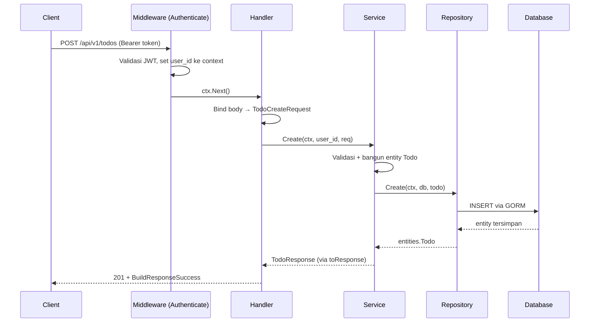
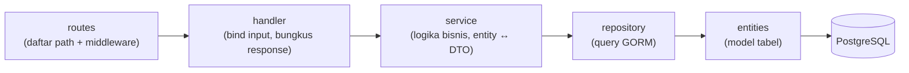
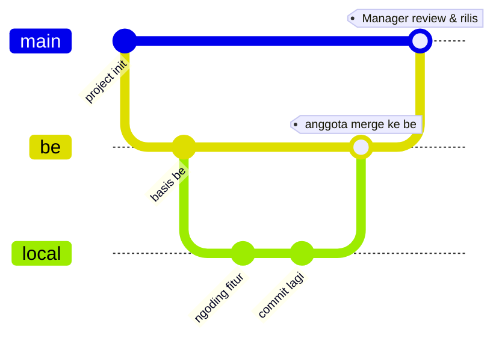

# Development Workflow

Panduan cara kerja harian untuk backend TEDx UNAIR. Baca ini sebelum mulai
mengerjakan fitur pertamamu.

---

## 1. Stack & Tools

| Kebutuhan | Teknologi |
|-----------|-----------|
| Bahasa | Go 1.25 |
| HTTP framework | [Gin](https://github.com/gin-gonic/gin) |
| ORM / Database | [GORM](https://gorm.io) + PostgreSQL (`uuid-ossp`) |
| Auth | JWT access token ([golang-jwt v4](https://github.com/golang-jwt/jwt)) + refresh token opaque |
| Dependency Injection | [samber/do](https://github.com/samber/do) |
| Config | [godotenv](https://github.com/joho/godotenv) + [viper](https://github.com/spf13/viper) |
| Email | [Brevo](https://www.brevo.com) transactional API |
| Live reload (dev) | [air](https://github.com/air-verse/air) |

---

## 2. Setup Lokal

### Prasyarat
- Go 1.25+
- PostgreSQL berjalan, dengan database sesuai `DB_NAME` (aplikasi otomatis membuat extension `uuid-ossp` saat boot)

### Langkah
```bash
cp .env.example .env      # lalu isi nilainya (lihat tabel di README.md)
go mod download
go run ./cmd              # atau: air  (live reload)
```

> **PENTING:** Selalu jalankan dari **root project** (`go run ./cmd`), bukan dari dalam
> folder `cmd/`. File `.env` dimuat dengan path relatif, sehingga menjalankan dari folder
> lain akan menyebabkan panic `open .env: file not found`.

Server listen di `GOLANG_PORT` (default `8888`). Saat boot ia menjalankan AutoMigrate
dan menampilkan banner TEDx.

---

## 3. Arsitektur & Alur Request

Project ini memakai **layout modular per-fitur**. Setiap fitur berdiri sendiri di
`modules/<fitur>/` dan mengikuti alur berlapis yang sama:

```
routes → handler → service → repository → entities (database)
```

Tanggung jawab tiap lapisan (batasan ini WAJIB dijaga):

| Lapisan | Tugas | TIDAK boleh |
|---------|-------|-------------|
| **routes** | Mendaftarkan path ke handler + memasang middleware (mis. auth). | Berisi logika bisnis. |
| **handler** | Baca input (bind body/query/param), panggil service, bungkus response. | Akses database langsung; berisi logika bisnis. |
| **service** | Logika bisnis, validasi, transformasi entity ↔ DTO. | Menyentuh `*gin.Context` atau detail HTTP. |
| **repository** | Query database (GORM) saja. | Berisi logika bisnis atau aturan HTTP. |
| **entities** | Definisi model GORM (tabel). | Berisi logika apa pun selain hook GORM. |

Aturan arah ketergantungan: **lapisan atas memanggil lapisan bawah, tidak pernah sebaliknya.**
Handler tahu tentang service, service tahu tentang repository. Repository tidak tahu apa-apa soal handler.

### Contoh alur nyata (POST /api/v1/todos)
1. `routes.go` mengarahkan `POST ""` ke `todoHandler.Create`, di belakang middleware `Authenticate`.
2. `Authenticate` memvalidasi JWT dan menaruh `user_id` ke context.
3. `handler.Create` bind body ke `TodoCreateRequest`, ambil `user_id`, panggil `service.Create`.
4. `service.Create` validasi, bangun entity `Todo`, panggil `repository.Create`.
5. `repository.Create` menyimpan ke database via GORM, mengembalikan entity.
6. `service` mengubah entity ke `TodoResponse`, `handler` membungkus dengan `BuildResponseSuccess` dan mengembalikan `201`.

Secara visual, alur request `POST /api/v1/todos`:



Dan pembagian lapisan secara umum:



---

## 4. Kontrak Response API

Semua endpoint **wajib** mengembalikan envelope yang sama (`pkg/utils/response.go`):

```json
{
  "status": true,
  "message": "success get list todo",
  "data": {},
  "error": "...",
  "meta": {}
}
```

Gunakan helper, jangan menyusun struct `Response` manual:

```go
// Sukses
utils.BuildResponseSuccess(dto.MESSAGE_SUCCESS_GET_TODO, result)

// Gagal
utils.BuildResponseFailed(dto.MESSAGE_FAILED_GET_TODO, err.Error(), nil)
```

Konvensi status HTTP (ikuti seperti modul `todo`):

| Aksi | Sukses | Gagal |
|------|--------|-------|
| Create | `201 Created` | `400 Bad Request` |
| GetAll | `200 OK` | `400 Bad Request` |
| GetByID | `200 OK` | `404 Not Found` |
| Update | `200 OK` | `400 Bad Request` |
| Delete | `200 OK` | `400 Bad Request` |
| Gagal bind input | — | `400` + `AbortWithStatusJSON` |
| Auth gagal | — | `401 Unauthorized` |

---

## 5. Konvensi Penamaan & Gaya Kode

- **Package** sesuai lapisan: `dto`, `handler`, `service`, `repository`.
- **Interface + implementasi:** deklarasikan `TodoService` (interface, huruf besar) dan
  `todoService` (struct implementasi, huruf kecil). Constructor `NewTodoService(...)`.
- **Pesan response** disimpan sebagai konstanta di DTO dengan awalan
  `MESSAGE_SUCCESS_*` dan `MESSAGE_FAILED_*`. Jangan menulis string pesan langsung di handler.
- **Error domain** dideklarasikan sebagai `var Err... = errors.New(...)` di DTO,
  lalu dipetakan ke status HTTP di handler.
- **Format kode** wajib `gofmt`/`go fmt` sebelum commit. Jalankan `go vet ./...`.
- **DTO Update** memakai pointer (`*string`, `*bool`) agar bisa membedakan "tidak dikirim"
  vs "dikirim dengan nilai kosong" — lihat `TodoUpdateRequest`.

---

## 6. Alur Git & Branching

Project ini memakai **tiga tingkat branch**. Tujuannya: kode tim tidak pernah
langsung masuk ke branch utama tanpa direview.

| Branch | Peran | Siapa yang boleh push / merge |
|--------|-------|-------------------------------|
| **`main`** | Branch utama (produksi). Sumber kebenaran project. | **Hanya Manager Backend & Co-Manager.** |
| **`be`** | Branch integrasi hasil kerja tim. Tempat semua fitur dikumpulkan sebelum direview. | Semua anggota backend (merge dari branch lokal masing-masing). |
| **`local`** | Branch kerja pribadi tiap anggota. Nama bebas (`dev`, `coba`, `feat/event`, dll). | Pemilik branch itu sendiri. |

### Aturan pokok (WAJIB)
1. **Anggota tidak boleh push/merge langsung ke `main`.** Selamanya lewat `be` dulu.
2. **`main` hanya disentuh oleh Manager & Co-Manager**, setelah review di `be` dinyatakan aman.
3. Semua pekerjaan dimulai dari branch lokal baru, **dibuat dari `be`** (bukan dari `main`).

### Alur kerja anggota backend (langkah demi langkah)



> Alur: anggota bercabang dari `be` → kerja di branch lokal → merge kembali ke `be`.
> Hanya Manager/Co-Manager yang menutup lingkaran dengan merge `be` → `main`.

1. **Pastikan `be` terbaru** sebelum mulai:
   ```bash
   git checkout be
   git pull origin be
   ```
2. **Buat branch lokal baru dari `be`** (nama bebas, disarankan deskriptif):
   ```bash
   git checkout -b feat/event-crud     # atau: dev, coba, dsb.
   ```
3. **Ngoding di branch lokal.** Setelah selesai satu bagian, commit:
   ```bash
   git add .
   git commit -m "feat: add event CRUD module"
   ```
4. **Sebelum merge**, pastikan lolos verifikasi (lihat bagian bawah):
   `go build ./...`, `go vet ./...`, `go test ./...`.
5. **Merge branch lokal ke `be`** (JANGAN ke `main`):
   ```bash
   git checkout be
   git pull origin be          # tarik update terbaru dulu agar tidak konflik
   git merge feat/event-crud
   git push origin be
   ```
6. Kabari Manager/Co-Manager bahwa ada kode baru di `be` untuk direview.

### Alur review & rilis (Manager & Co-Manager)
1. Review kode yang masuk di branch `be` (kesesuaian pola, keamanan, test lulus).
2. Jika ada yang perlu diperbaiki, minta anggota memperbaiki di branch lokalnya lalu merge ulang ke `be`.
3. Jika sudah aman, **merge `be` → `main`**:
   ```bash
   git checkout main
   git pull origin main
   git merge be
   git push origin main
   ```

### Konvensi commit
Pesan commit mengikuti [Conventional Commits](https://www.conventionalcommits.org/):
`feat: ...`, `fix: ...`, `chore: ...`, `docs: ...`.

### Checklist sebelum merge ke `be`
- [ ] Mengikuti pola modul `todo` (routes → handler → service → repository).
- [ ] Response memakai `BuildResponseSuccess` / `BuildResponseFailed`.
- [ ] Pesan sukses/gagal disimpan sebagai konstanta di DTO.
- [ ] Entity baru (jika ada) sudah didaftarkan di `database/migrations.go`.
- [ ] Dependency baru sudah di-wire di `providers/core.go`.
- [ ] `go build`, `go vet`, `go test` lulus.
- [ ] Tidak ada secret/kredensial yang ter-commit (cek `.env` tetap di-ignore).
- [ ] Dokumentasi API diperbarui bila ada perubahan endpoint.

> **Catatan penguatan (opsional):** Agar aturan "hanya Manager/Co-Manager yang boleh ke `main`"
> benar-benar terkunci, aktifkan **branch protection** di GitHub pada branch `main` (Settings →
> Branches → Add rule): batasi siapa yang boleh push, dan wajibkan review. Tanpa ini, aturan
> hanya berlaku sebagai kesepakatan tim, bukan paksaan teknis.

---

## 7. Keamanan & Environment

- File `.env` **git-ignored** — jangan pernah commit. Bagikan lewat channel aman, bukan repo.
- Endpoint yang butuh login **wajib** di belakang middleware `Authenticate` (lihat `modules/todo/routes.go`).
- `user_id` diambil dari token via `ctx.MustGet("user_id")`, **bukan** dari body request.
  Ini mencegah user memalsukan kepemilikan data.
- Setiap query data milik user **wajib** menyertakan filter `user_id` (lihat
  `repository.GetByID` yang memfilter `id = ? AND user_id = ?`) agar user tidak bisa
  mengakses data user lain.

---

## 8. Testing

```bash
go test ./...
```

Tulis unit test untuk logika service (bagian yang paling banyak berisi aturan bisnis).
Contoh pola test sudah ada di `modules/bundle/service/bundle_service_test.go`
(unit test service memakai fake repository, tanpa koneksi database). Untuk fitur baru
minimal uji: happy path, input tidak valid, dan kasus "data tidak ditemukan".

---

## 9. Knowledge Graph (opsional, membantu navigasi)

Project ini punya peta kode di `graphify-out/` (dibuat dengan Graphify). Untuk
memahami relasi antar-file dengan cepat:

```bash
graphify query "how does user registration work"   # tanya alur
graphify explain "AuthService"                       # jelaskan satu komponen
graphify update .                                    # perbarui peta setelah ngoding
```

Peta ini opsional dan tidak memengaruhi runtime aplikasi. Berguna terutama untuk
anggota baru yang ingin cepat paham struktur.
